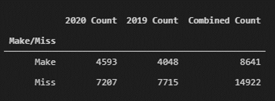
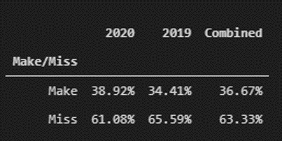
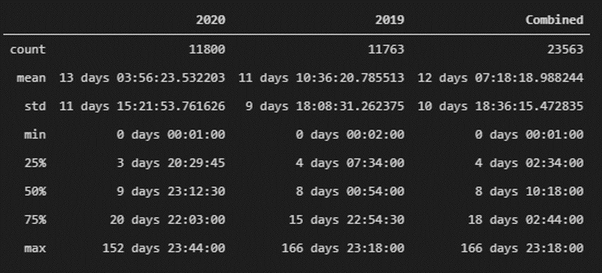
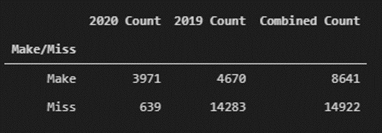
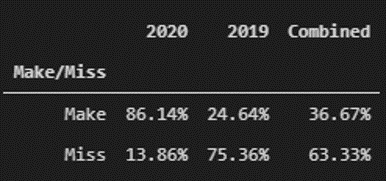
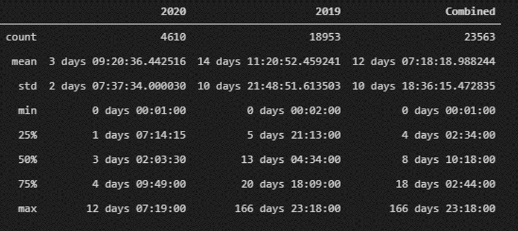

# ECT Report Analysis
## Description of ECT Report
Quoting the description on the report home page:
>"Average time in days it takes for a Customers issue to be resolved measured from the day the Customer contacts the Call Center and a Service Order is opened unitl the case status is moved to closed. Calculation includes FOD, CRU, On-Site and Depot Service Orders."

The SLA goal is 5.60 days.

## Method for KPI Calculation
The report performs a simple calculation to determine whether or not a case met the SLA. If the case is open for less than 5.60 days then it is marked as a `Make`; otherwise it will be a `Miss`. This calculation is performed by subtracting the values in columns `SR Close TS` and `SR Create TS`.

The KPI for this metric is calculated by the mean value of the subtraction of `SR Close TS` and `SR Create TS` for each row in the data set.

## Data Analysis (Using `SR Close TS`, mirrors reporting tool)
We pulled all data from the ECT Report portal and ran an analysis on the data set. The formula used by the ECT Report was replicated. This was confirmed by duplicating the results for the means.
First, we have the total counts of `Make` and `Miss` by year. The years were filtered by looking at the `SR Close TS` date.

Next, we pulled the `Make` and `Miss` percentages by year.

Below is the summary statistics for the difference between `SR Close TS` and `SR Create TS`.

## Data Analysis (Using `SR Create TS`)
The previous data analysis was done with the same parameters on the report. However, in this one we will filter the data using the case creation date rather than the closure date. This should provide a better idea of performance to date.

First, total counts of `Make` and `Miss` by year.

Next, `Make` and `Miss` percentages by year.

Below is the summary statistics for the difference between `SR Close TS` and `SR Create TS`.

## Observations from the Data
* The max value for 2020 is over 152 days when we filter by closure date. Filtering by open date we get a more realistic result at 12 days. The 152 day old case was examined and we noticed that it was actioned by the call center on the same day that it was created, but the closure was delayed due to the depot losing the machine and finally closing the case earlier this year.
* By using the open date for 2020, the mean KPI drops about 2.30 days.

## Limitations of the Report
* By default this report measures *all* available data regardless of case age. Therefore the KPI reflects *all* cases since the reporting tool started capturing data. This is the number shown in the dashboard.
* The column `SR Close TS` has the value of the case's final closure date. This value is not reflective of the performance of the call center as this event is triggered when all work on the case is completed (CX status). A few examples for possible delays outside of the call center's control:
    * Limited part availability.
    * Customer delaying service (additional information needed, not available).
    * Technician not available to service machine.
    * Machine lost in transit.
    * Carrier unable to deliver a part.
* Changing the date range on the report filters the data by the values in the `SR Close TS` column. For example, we may pick all cases YTD for our values, and the report will pull cases which were opened prior to the current year if the `SR Close TS` value is on the current year.
* There is no true indicator of call center performance in the data columns. The best indicator would be the time when the first action plan (AP) is placed on a case. This metric is not available as of writing this report.
* Using `SR Close TS` as the date filter instead of `SR Open TS` is misleading. It doesn’t reflect monthly performance as it captures cases that were opened prior to the current month.
## Conclusion
The ECT Report does not serve as an objective measure of the performance of the call center due to its inherent limitations. The case closure time is the determinant factor into whether the KPIs are met. This number is not reflective of the actions performed by the call center. A better measure would be the first AP time on the case. Delays in the field can cause cases to remain open and for the closure time to be delayed indefinitely.